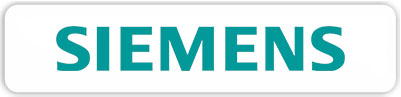

# Implementation Tasks — Senties Chauvet Site Redesign

## TASKS.md — Checklist

---

## CSS Changes (`styles.css`)

### TASK-1: Add new CSS custom properties to `:root`
**Files**: `styles.css`
**What**: Add the following tokens inside the existing `:root` block (after existing tokens, before closing `}`):

```css
/* SAI section */
--sai-bg: linear-gradient(135deg, var(--primary) 0%, var(--primary-light) 100%);
--sai-surface: rgba(255, 255, 255, 0.06);
--sai-surface-border: rgba(255, 255, 255, 0.10);

/* Accent glow for SAI callout */
--accent-glow: 0 0 0 1px rgba(255, 117, 48, 0.30), 0 4px 24px rgba(255, 117, 48, 0.25);

/* MEXDC Partner badge */
--badge-mexdc-bg: rgba(0, 43, 73, 0.08);
--badge-mexdc-bg-hover: rgba(0, 43, 73, 0.14);
--badge-mexdc-icon-bg: rgba(255, 117, 48, 0.12);

/* MEXDC logo grid */
--mexdc-logo-card-border: 1px solid rgba(0, 0, 0, 0.05);
--mexdc-logo-card-shadow: var(--shadow-sm);
--mexdc-logo-card-shadow-hover: 0 8px 20px rgba(0, 0, 0, 0.08);

/* Section spacing helper */
--section-pad: 80px 24px;
```

**Notes**:
- `--primary-light` must exist in your current `:root` (it's referenced in `--sai-bg`). If it doesn't exist, use a lighter navy variant or add `--primary-light` first.
- Existing `--primary` value is `#002B49` — no change needed.

---

### TASK-2: Add dark-theme overrides
**Files**: `styles.css`
**What**: Inside the existing `body.dark-theme {}` block, add:

```css
--badge-mexdc-bg: rgba(37, 70, 98, 0.18);
--badge-mexdc-bg-hover: rgba(37, 70, 98, 0.28);
--mexdc-logo-card-border: 1px solid rgba(255, 255, 255, 0.06);
```

---

### TASK-3: Add MEXDC Trust section styles
**Files**: `styles.css`
**What**: Add these styles after existing section styles (e.g., after `.services` or before `.partners`):

```css
/* ── MEXDC Trust Section ── */
.mexdc-trust { padding: var(--section-pad); }
.mexdc-trust-inner {
  max-width: var(--max-width);
  margin: 0 auto;
  text-align: center;
}

.mexdc-logo-grid {
  display: grid;
  grid-template-columns: repeat(5, 1fr);
  gap: 16px;
  margin: 40px 0 32px;
}
.mexdc-logo-card {
  display: flex;
  align-items: center;
  justify-content: center;
  background: var(--surface);
  border: var(--mexdc-logo-card-border);
  border-radius: var(--radius-md);
  padding: 24px 16px;
  height: 96px;
  box-shadow: var(--mexdc-logo-card-shadow);
  transition: transform 0.25s, box-shadow 0.25s;
}
.mexdc-logo-card:hover {
  transform: translateY(-2px);
  box-shadow: var(--mexdc-logo-card-shadow-hover);
}
.mexdc-logo-card img {
  max-height: 48px;
  max-width: 100%;
  width: auto;
  object-fit: contain;
  filter: grayscale(0.4);
  opacity: 0.85;
  transition: filter 0.25s, opacity 0.25s;
}
.mexdc-logo-card:hover img { filter: grayscale(0); opacity: 1; }

/* Partner badge pill */
.mexdc-badge {
  display: inline-flex;
  align-items: center;
  gap: 8px;
  padding: 8px 16px;
  background: var(--badge-mexdc-bg);
  border-radius: 999px;
  font-size: 0.85rem;
  font-weight: 600;
  color: var(--primary);
  transition: background 0.2s, transform 0.2s;
}
.mexdc-badge:hover {
  background: var(--badge-mexdc-bg-hover);
  transform: translateY(-1px);
}
.mexdc-badge-icon {
  display: inline-flex;
  width: 22px; height: 22px;
  align-items: center; justify-content: center;
  background: var(--badge-mexdc-icon-bg);
  color: var(--accent);
  border-radius: 50%;
  font-size: 0.7rem;
}
.mexdc-badge-ext { font-size: 0.65rem; opacity: 0.55; }
```

---

### TASK-4: Add SAI section styles
**Files**: `styles.css`
**What**: Add after `.mexdc-trust` styles:

```css
/* ── SAI Section ── */
.sai {
  padding: var(--section-pad);
  background: var(--sai-bg);
  color: var(--text-inverse);
}
.sai-inner {
  max-width: var(--max-width);
  margin: 0 auto;
  display: grid;
  grid-template-columns: 1.2fr 1fr;
  gap: 56px;
  align-items: center;
}
.sai .sai-label,
.sai .section-label { color: rgba(255, 255, 255, 0.7); }
.sai h2 { color: #fff; margin-bottom: 16px; }
.sai-desc { color: rgba(255, 255, 255, 0.75); font-size: 1.05rem; }

.sai-differentiators {
  list-style: none;
  margin: 32px 0 0;
  display: grid;
  grid-template-columns: repeat(2, 1fr);
  gap: 18px;
}
.sai-differentiators li {
  display: flex;
  gap: 12px;
  align-items: flex-start;
}
.sai-differentiators strong { color: #fff; display: block; font-size: 0.95rem; }
.sai-differentiators span { color: rgba(255, 255, 255, 0.6); font-size: 0.85rem; }
.sai-diff-icon {
  width: 36px; height: 36px;
  display: inline-flex; align-items: center; justify-content: center;
  background: var(--sai-surface);
  border: 1px solid var(--sai-surface-border);
  border-radius: var(--radius-sm);
  color: var(--accent);
  flex-shrink: 0;
}

/* The "1 hora" callout */
.sai-highlight {
  background: var(--sai-surface);
  border: 1px solid var(--sai-surface-border);
  border-radius: var(--radius-lg);
  padding: 40px 32px;
  text-align: center;
}
.sai-callout-label {
  display: block;
  font-size: 0.7rem;
  font-weight: 600;
  letter-spacing: 0.15em;
  text-transform: uppercase;
  color: rgba(255, 255, 255, 0.5);
  margin-bottom: 16px;
}
.sai-callout {
  font-family: var(--font-heading);
  font-size: clamp(1.6rem, 3vw, 2.2rem);
  line-height: 1.2;
  color: #fff;
  margin-bottom: 16px;
}
.sai-callout strong { color: var(--accent); font-weight: 500; }
.sai-callout-note {
  color: rgba(255, 255, 255, 0.55);
  font-size: 0.85rem;
}
.sai-highlight:hover .sai-callout strong {
  text-shadow: var(--accent-glow);
}
```

---

### TASK-5: Update services grid to 3 columns + hero badge modifier
**Files**: `styles.css`
**What**: Find existing `.services-grid` rule and change `grid-template-columns`:

```css
.services-grid {
  grid-template-columns: repeat(3, 1fr); /* was repeat(2, 1fr) */
}
```

Also add the hero badge modifier:

```css
.hero-badge--mexdc {
  display: inline-flex;
  align-items: center;
  gap: 8px;
}
.hero-badge-check { color: var(--accent); font-size: 0.85rem; }
```

---

### TASK-6: Add responsive styles for mobile
**Files**: `styles.css`
**What**: Find existing `@media (max-width: 768px)` block and add inside it:

```css
/* MEXDC logo grid — horizontal scroll on mobile */
.mexdc-logo-grid {
  display: flex;
  overflow-x: auto;
  scroll-snap-type: x mandatory;
  gap: 12px;
  padding-bottom: 8px;
  -webkit-overflow-scrolling: touch;
}
.mexdc-logo-card {
  flex: 0 0 140px;
  scroll-snap-align: start;
}
.mexdc-logo-grid::-webkit-scrollbar { display: none; }
.mexdc-logo-grid { scrollbar-width: none; }

/* SAI section — single column on mobile */
.sai-inner { grid-template-columns: 1fr; }
.sai-highlight { order: 2; }

/* Services — single column on mobile */
.services-grid { grid-template-columns: 1fr; }
```

---

### TASK-7: Add footer MEXDC link styles
**Files**: `styles.css`
**What**: Add after existing `.footer-note` styles:

```css
.footer-note a {
  color: var(--accent);
  font-weight: 500;
  text-decoration: underline;
  text-decoration-color: rgba(255, 117, 48, 0.4);
  text-underline-offset: 2px;
}
.footer-note a:hover { text-decoration-color: var(--accent); }
```

---

## HTML Changes (`index.html`)

### TASK-8: Update Header nav links
**Files**: `index.html`
**What**: In `<nav>`, update the anchor hrefs:
- `SAI` → `#sai`
- `Servicios` → `#servicios`
- `Niveles` → `#niveles`
- `Contacto` → `#contacto`

Also update mobile menu links to match.

---

### TASK-9: Update Hero section
**Files**: `index.html`
**What**: Inside `.hero`, make these changes:

1. **Badge** — replace current badge span with:
   ```html
   <span class="hero-badge hero-badge--mexdc">
     <i class="fa-solid fa-circle-check hero-badge-check"></i>
     Partner MEXDC · Agente Afianzador Certificado
   </span>
   ```

2. **H1** — replace content with:
   ```html
   El agente afianzador que entiende el <em>ecosistema MEXDC</em>
   ```
   (The `<em>` keeps existing `color: var(--accent)` styling.)

3. **CTA2** — change href from `#servicios` to `#sai`; change text from "Ver servicios" to "Conocer SAI"; remove the arrow icon from CTA2 to keep it visually secondary.

---

### TASK-10: Add MEXDC Trust section (NEW)
**Files**: `index.html`
**What**: Insert this new section **after** the closing `</header>` (or after hero) and **before** any existing service/section:

```html
<section class="mexdc-trust" id="mexdc-trust" aria-labelledby="mexdc-trust-title">
  <div class="mexdc-trust-inner">
    <div class="section-header">
      <span class="section-label">Credibilidad</span>
      <h2 id="mexdc-trust-title">Miembro del ecosistema MEXDC</h2>
      <p class="section-desc">
        La Asociación Mexicana de Data Centers (MEXDC) reúne a operadores, proveedores
        y profissionais del ecosistema digital en México. Pertenecer al ecosistema es
        una señal de credibilidad verificable públicamente.
      </p>
    </div>

    <div class="mexdc-logo-grid" role="list">
      <div class="mexdc-logo-card" role="listitem">
        
      </div>
      <div class="mexdc-logo-card" role="listitem">
        
      </div>
      <div class="mexdc-logo-card" role="listitem">
        
      </div>
      <div class="mexdc-logo-card" role="listitem">
        
      </div>
      <div class="mexdc-logo-card" role="listitem">
        
      </div>
    </div>

    <a href="https://asmexdc.com/socios-y-asociados/"
       class="mexdc-badge"
       target="_blank"
       rel="noopener">
      <span class="mexdc-badge-icon"><i class="fa-solid fa-circle-check"></i></span>
      <span class="mexdc-badge-text">Partner MEXDC</span>
      <i class="fa-solid fa-arrow-up-right-from-square mexdc-badge-ext" aria-hidden="true"></i>
    </a>
  </div>
</section>
```

**Notes**:
- Logo filenames use the actual downloaded files: `equinix.png`, `kio.webp`, `schneider.png`, `siemens.jpg`, `microsoft.webp`
- Path is `assets/mexdc-logos/` (the user downloaded them to this folder)

---

### TASK-11: Add SAI section (PROMOTED)
**Files**: `index.html`
**What**: Insert this new section **after** MEXDC Trust section:

```html
<section class="sai" id="sai" aria-labelledby="sai-title">
  <div class="sai-inner">
    <div class="sai-content">
      <span class="section-label sai-label">Metodología Propia</span>
      <h2 id="sai-title">SAI: El análisis que cambia cómo eligen sus afianzadoras</h2>
      <p class="sai-desc">
        Supplier Analysis es nuestra plataforma propia de análisis financiero y de
        riesgo para proveedores del ecosistema de data centers. Convierte la
        evaluación de un fiado en datos accionables antes de comprometer una fianza.
      </p>

      <ul class="sai-differentiators">
        <li>
          <span class="sai-diff-icon"><i class="fa-solid fa-heart-pulse"></i></span>
          <div>
            <strong>Score de salud</strong>
            <span>Indicador sintético de solvencia del proveedor.</span>
          </div>
        </li>
        <li>
          <span class="sai-diff-icon"><i class="fa-solid fa-triangle-exclamation"></i></span>
          <div>
            <strong>Indicadores de riesgo</strong>
            <span>Alertas tempranas sobre obligaciones y litigios.</span>
          </div>
        </li>
        <li>
          <span class="sai-diff-icon"><i class="fa-solid fa-file-invoice-dollar"></i></span>
          <div>
            <strong>Datos fiscales</strong>
            <span>Cumplimiento y situación ante el SAT.</span>
          </div>
        </li>
        <li>
          <span class="sai-diff-icon"><i class="fa-solid fa-layer-group"></i></span>
          <div>
            <strong>Concentración comercial</strong>
            <span>Dependencia de clientes y proveedores clave.</span>
          </div>
        </li>
      </ul>
    </div>

    <aside class="sai-highlight" aria-label="Resultado SAI">
      <span class="sai-callout-label">Resultado</span>
      <p class="sai-callout">Evaluación en <strong>1 hora</strong>, no en semanas</p>
      <span class="sai-callout-note">Mientras una evaluación manual toma de 2 a 4 semanas, SAI entrega el análisis del fiado en menos de 60 minutos con el expediente completo.</span>
    </aside>
  </div>
</section>
```

---

### TASK-12: Update Services section
**Files**: `index.html`
**What**: Inside the `#servicios` section:
1. Remove the SAI service card (the 4th card)
2. Update `.services-grid` class — keep only 3 cards: Emisión y administración, Programas corporativos, Gestión jurídica
3. Remove the `grid-template-columns: repeat(2, 1fr)` override if it exists (CSS TASK-5 handles this)

**Note**: The 3 remaining cards should use the existing `.service-card` class structure.

---

### TASK-13: Update Afianzadoras section (rename)
**Files**: `index.html`
**What**: Inside `.partners` section:
- Change section label to: `<span class="section-label">Respaldo</span>`
- Change H2 to: `Respaldados por las principales afianzadoras de México`
- Update the paragraph to: `Las fianzas que emitimos cuentan con el respaldo de aseguradoras autorizadas por la CNSF. Emisoras, no operadoras: son las que asumen el riesgo afianzador.`

---

### TASK-14: Update Footer
**Files**: `index.html`
**What**: Inside `.footer-note`, add a new link:

```html
<p class="footer-note">
  Agente afianzador certificado.
  <a href="https://asmexdc.com/socios-y-asociados/"
     target="_blank" rel="noopener">Miembro de MEXDC · asmexdc.com</a>.
  Fianzas respaldadas por compañías autorizadas por la CNSF.
</p>
```

**Notes**:
- Keep the existing copyright line unchanged.
- Keep the CNSF mention unchanged.
- The new MEXDC link goes between "Agente afianzador certificado." and "Fianzas respaldadas..."

---

## Asset Management

### TASK-15: Verify logo assets
**Files**: None (asset verification)
**What**: Confirm that `assets/mexdc-logos/` contains the 5 files:
- `equinix.png`
- `kio.webp`
- `schneider.png`
- `siemens.jpg`
- `microsoft.webp`

The DESIGN.md references `assets/mexdc/` but the user downloaded to `assets/mexdc-logos/`. The HTML in TASK-10 uses `assets/mexdc-logos/` — ensure this path matches the actual folder name.

**If the folder is named `assets/mexdc/` instead**: change `assets/mexdc-logos/` to `assets/mexdc/` in TASK-10 HTML.

---

## Verification Checklist

After applying all tasks, verify:

- [ ] Hero badge shows check icon + "Partner MEXDC · Agente Afianzador Certificado"
- [ ] H1 contains `<em>ecosistema MEXDC</em>` with accent color
- [ ] CTA2 links to `#sai` and says "Conocer SAI"
- [ ] MEXDC Trust section appears between Hero and SAI with 5 logos
- [ ] MEXDC logo grid scrolls horizontally on mobile (≤768px)
- [ ] Partner badge links to `asmexdc.com/socios-y-asociados/` in new tab
- [ ] SAI section has gradient background distinct from `.levels`
- [ ] SAI "1 hora" callout is visually prominent with accent color
- [ ] Services section shows exactly 3 cards (no SAI card)
- [ ] Services grid is 3-column on desktop
- [ ] Afianzadoras section label is "Respaldo" with new H2
- [ ] Footer has MEXDC link with accent styling
- [ ] Nav links point to `#sai`, `#servicios`, `#niveles`, `#contacto`
- [ ] Page scrolls smoothly to `#sai` on CTA2 click
- [ ] No JS changes needed — `scroll-behavior: smooth` handles it
